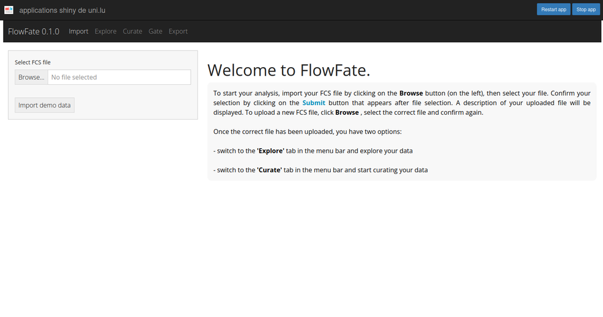
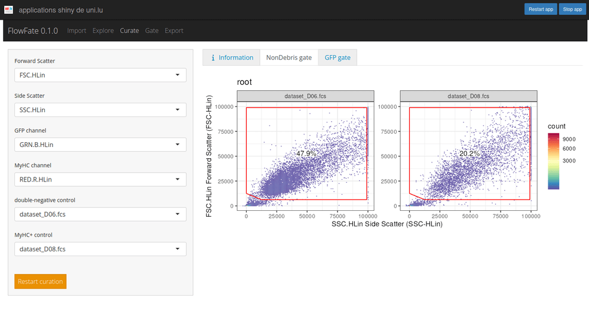

# flowFate

**FlowFate** is a free, interactive [Shiny](https://shiny.posit.co/) web application developed to automate the analysis of cell differentiation data obtained by flow cytometry. We developed **flowFate** by combining existing R packages

-   [flowCore](https://bioconductor.org/packages/release/bioc/html/flowCore.html) and [flowWorkspace](https://www.bioconductor.org/packages/release/bioc/html/flowWorkspace.html) for FCS file import data manipulation and gating
-   [ggcyto](https://www.bioconductor.org/packages/release/bioc/html/ggcyto.html) for visualization

into a customized workflow tailored to the analysis of differentiation data. We were able to automate a crucial and time-consuming process of data analysis using [openCyto's](https://www.bioconductor.org/packages/release/bioc/html/openCyto.html) data-driven gating functions.

Built with [{golem}](https://github.com/ThinkR-open/golem).

## Background

**FlowFate** has been designed for the analysis of cell differentiation data obtained according to [Chippalkatti et al's]() protocol. Briefly, C2C12 cells that can turn into (or "differentiate") into muscle cells at some point in their life cycle. Until they differentiate, these cells are in an immature state (scientists call them "undifferentiated"). Technically, one could analyze a pool of C2C12 cells under the microscope and visually determine the percentage of differentiated cells in a specific condition (temperature, nutrients, ...). Practically however, this too tedious. Luckily, differentiated muscle cells produce a protein called myosin not (or only in low amounts) produced by undifferentiated cells. Using an antibody attached to a fluorescent molecule (i.e a molecule that can emit light of a certain wavelength when excited by a laser), it is possible to stain myosin and analyze the pool of cells using a flow cytometer. A flow cytometer is a device used in biological research channels cells through a small capillary so that they pass in front of a laser one-by-one. This laser light excites the fluorescent molecule attached to our antibody, the antibody itself being attached to myosin if this protein is present in the cell. The light emitted by the fluorescent molecule in response to this excitation can be captured by a camera. The amount of light captured reflects the amount of myosin present in the cell, allowing us to determine if a cell is differentiated or not. Keep in mind that even undifferentiated cells can produce small amounts of myosin and therefore the differentiated cells we're interested in are those that produce larger amounts.

## Installation: users outside the University of Luxembourg

### Install R and R Studio

Click [here](https://posit.co/download/rstudio-desktop/) for download instructions.

<strong> Note: </strong> Skip this step if you access R via a server.

### Install flowFate

Once R and R Studio have been installed, run the commands below in the given order in your [R Studio console](https://docs.posit.co/ide/user/ide/guide/ui/ui-panes.html). Because of the large amount of dependencies, installation can take up to 15 minutes.

``` r
# install the remotes and BiocManager package
install.packages(c("remotes", "BiocManager"))
```

``` r
# install dependencies from Bioconductor
BiocManager::install(c("ggcyto", "flowWorkspace", "flowCore"))
remotes::install_github("openCyto")
```

``` r
# install the flowFate package
remotes::install_github("maximesunnen/flowFate")
```

``` r
# Launch the app
flowFate::run_app()
```

### Installation: users from the University of Luxembourg

Users having access to the network of the University of Luxembourg do not need to install R or R Studio but can use the following link instead: <https://shiny-server.uni.lu/app/flowfate>. Note that this link will only work when connected to the University's network.

### Get started

The app looks like:



An example of the Non-debris plots after gating:


